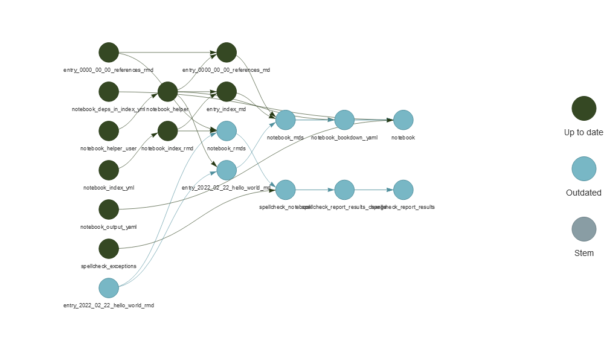
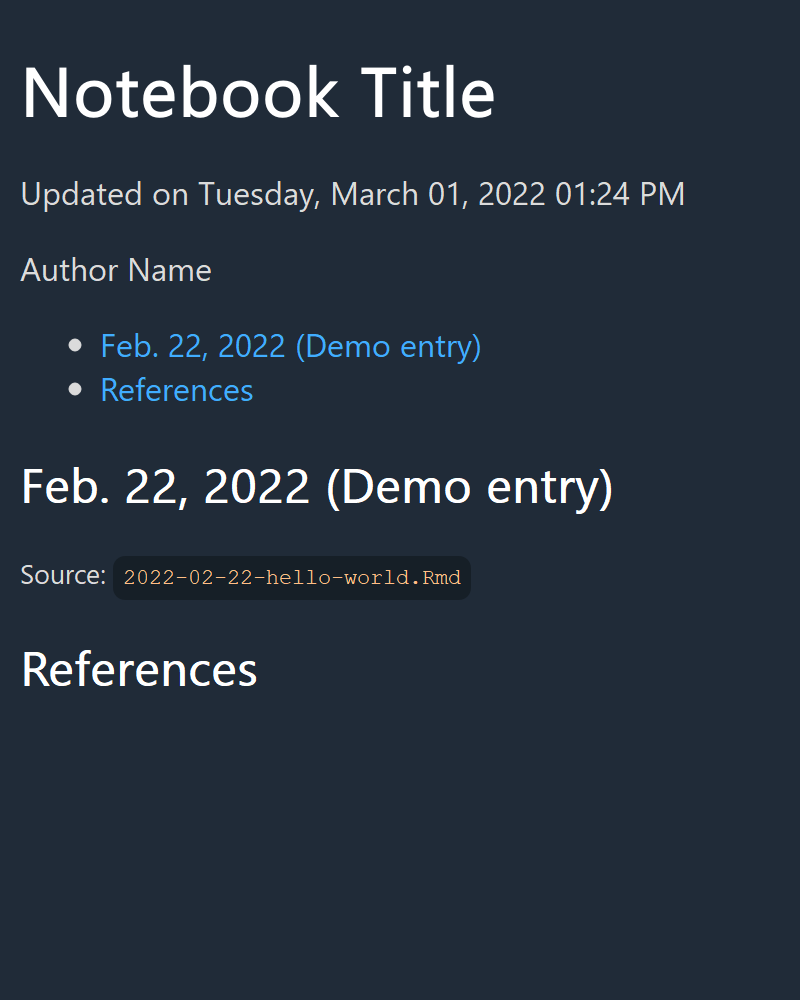
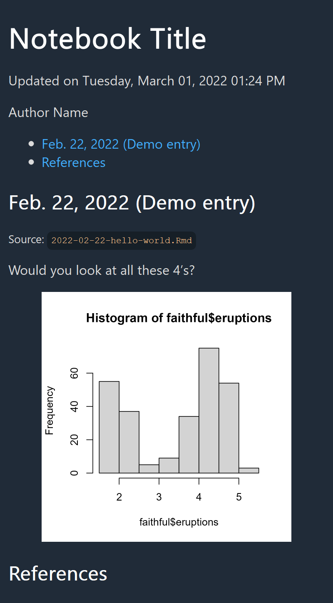
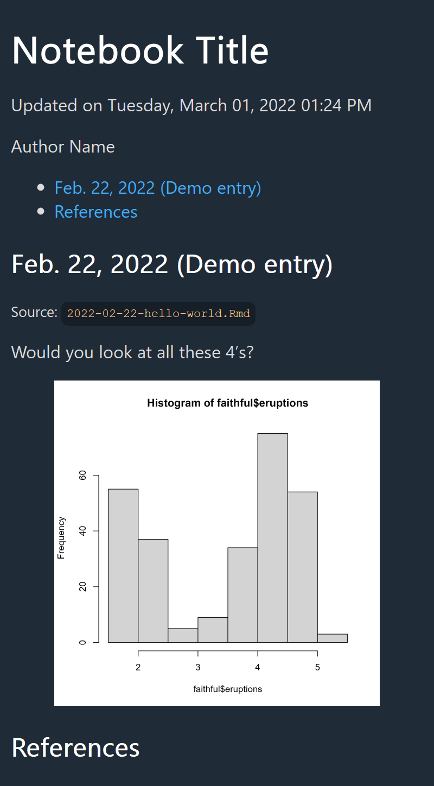
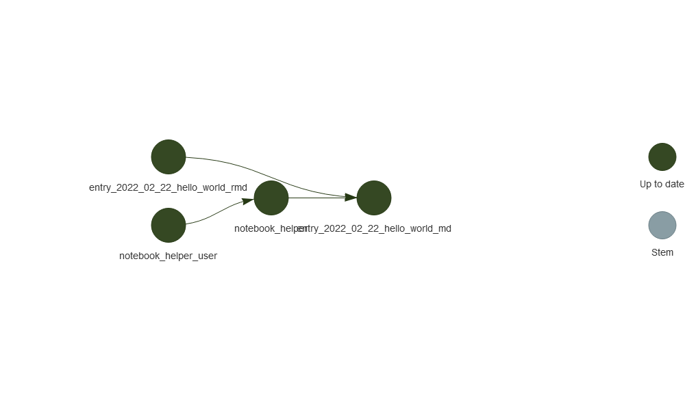
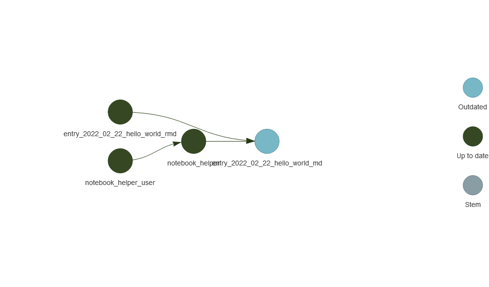

<!-- README.md is generated from README.Rmd. Please edit that file -->
<!-- say directory, not folder -->

# notestar 📓⭐

<!-- badges: start -->

[](https://github.com/tjmahr/notestar/actions)
<!-- badges: end -->

notestar is a notebook system built on the
[targets](https://docs.ropensci.org/targets/) package: *notes* with
*tar*gets.

## Installation

You can install notestar from [GitHub](https://github.com/) with:

``` r
# install.packages("devtools")
devtools::install_github("tjmahr/notestar")
```

## A demo notebook

Here is an example project/notebook showing how notestar combines
various .Rmd files into a single HTML file:
<https://github.com/tjmahr/notestar-demo>.

## Big picture idea of how notestar works

First, we follow a [targets](https://docs.ropensci.org/targets/)-based
workflow. We develop datasets and models and so on, writing functions in
R/functions.R and describing a build pipeline in `_targets.R`. Some
familiarity with the big ideas of the targets packages is required.

We then work with our data-analysis products in RMarkdown .Rmd files in
a notebook directory. We read in these targets using
`targets::tar_read()`, and we might develop several entries notebook as
we tackle different parts of our analysis problem.

In the `_targets.R` file, there are special notebook-related targets.
When we run `targets::tar_make()`, notestar does the following:

-   For each .Rmd file, it knits (`knitr::knit()`) the corresponding .md
    output file: computing running the code, printing the results,
    saving and inserting figures.

-   These .md files are collated and assembled into a single-page
    bookdown document. It looks kind of a data-analysis blog (a page
    with a sequence of entries in reverse-chronological order).

Importantly, **notestar only does these jobs when needed**. For example,
a notebook entry’s .md file will only be created if it is *outdated*.
That is,

-   if the .md has not been created yet.
-   if the .Rmd source file has changed at all.
-   if a dependency loaded via targets (i.e.,
    `data <-     targets::tar_read(data)`) in the .Rmd source file has
    changed.
-   if any other dependencies for the .md file have changed. (For
    example, there is an R script that run before knitting each entry
    that sets knitr options. If that changes, then the notebook entry is
    outdated.)

notestar’s role in all of this is to link the data analysis targets to
the .Rmd files and then orchestrate the assembly of a notebook from
these entries.

### Packages that help make this happen

Let’s highlight some packages that are indispensable for this scheme to
work.

-   [targets](https://docs.ropensci.org/targets/ "targets site")
    (backend)
-   [knitr](https://yihui.org/knitr/ "knitr site") (running R code in
    .Rmd files to .md files)
-   [bookdown](https://bookdown.org/yihui/bookdown/ "bookdown site")
    (assembling .md files into a .md file)
-   [rmarkdown](https://rmarkdown.rstudio.com/ "rmarkdown site") /
    [pandoc](https://pandoc.org/ "pandoc site") (for converting markdown
    into other formats)
-   [cleanrmd](https://github.com/gadenbuie/cleanrmd "cleanrmd: Clean Class-Less R Markdown HTML Documents")
    (theme/template for final html document)
-   [usethis](https://usethis.r-lib.org/ "usethis site") (functions for
    setting up R-based data analysis projects)

## Most important functions for users

Below I show a worked example and describe things in great detail. But
before that I want to note that as a user, I only really use 3–4
functions from this package.

-   `use_notestar()` to set up a notestar project
-   (optional) `use_notestar_makefile()` to set up a Makefile that runs
    `targets::tar_make()`. I then use the RStudio’s Build commands to
    build projects.
-   (optional) `use_notestar_references()` to set up a .bib and .csl
    file for the notebook.
-   `notebook_create_page()` to create a new notebook entry
-   `notebook_browse()` to open the final notebook file in a browser.

## A worked example

notestar works best inside of a data analysis project and specifically,
as a part of an [RStudio
project](https://support.rstudio.com/hc/en-us/articles/200526207-Using-RStudio-Projects).
That is, we have some directory for our project. Everything we do or
create will live in that directory, and that directory is the default
working directory for all of our R code.

For demonstration, let’s create a new directory inside of a temporary
directory and make that the home base for our project.

``` r
project_dir <- file.path(tempdir(), pattern = "my-project")
dir.create(project_dir)
setwd(project_dir)
```

Nothing here!

``` r
fs::dir_tree(all = TRUE)
#> .
```

### Initial file skeleton

`use_notestar()` will populate the project directory with the basic
skeleton for the project. We set the theme to `"water-dark"` so that the
screenshots below stick out better from the white background on GitHub.

``` r
library(notestar)
use_notestar(cleanrmd_theme = "water-dark")

fs::dir_tree(all = TRUE)
#> .
#> ├── .here
#> ├── config.yml
#> ├── notebook
#> │   ├── 0000-00-00-references.Rmd
#> │   ├── book
#> │   │   └── assets
#> │   ├── index.Rmd
#> │   └── knitr-helpers.R
#> ├── R
#> │   └── functions.R
#> └── _targets.R
```

The file **`config.yml`** is a
[config-package](https://rstudio.github.io/config/) configuration file.
These configuration options were set when we called `use_notestar()`, so
these are all the default configuration options (except for
`cleanrmd_theme`). Each of these is described by a `comment` field.

``` r
writeLines(readLines("config.yml"))
```

    ---
    default:
      notestar:
        dir_notebook:
          comment: >
            directory location for user-edited notebook entries (as
            RMarkdown files)
          value: "notebook"
        dir_md:
          comment: >
            directory location for knitted/rendered notebook entries
            (as markdown files)
          value: "notebook/book"
        notebook_helper:
          comment: >
            path to an R script that is run before knitting each notebook
            entry
          value: "notebook/knitr-helpers.R"
        cleanrmd_theme:
          comment: >
            CSS theme to use for the notebook. Anything printed by
            cleanrmd::cleanrmd_themes() should work.
          value: "water-dark"
        notebook_filename:
          comment: >
            Name to use for the final html file. Defaults to "notebook"
            which produces "notebook.html"
          value: "notebook"
    ---

Two .Rmd files are automatically included: `index.Rmd` and
`0000-00-00.Rmd`. These are the first and last entries (top and bottom
parts) of the notebook. **`index.Rmd`** houses metadata for the
notebook:

``` r
writeLines(readLines("notebook/index.Rmd"))
```

    ---
    title: "Notebook title"
    author: "Author Name"
    date: > 
      `r knitr::inline_expr('format(Sys.time(), "Updated on %A, %B %d, %Y %I:%M %p")')`
    site: bookdown::bookdown_site
    link-citations: true
    ---

The yaml metadata in `index.Rmd` is created automatically inside the
`_targets.R` file. More on that later.

**`0000-00-00.Rmd`** is not meant to be edited. As it tells us, it
provides a “References” heading. When the bibliography is appended to
the end of the notebook, it will be printed under this heading.

``` r
writeLines(readLines("notebook/0000-00-00-references.Rmd"))
```

    <!-- Chapters/posts are collated in reverse chronological order so  -->
    <!-- this last one is a dummy entry to tell bookdown where to drop  -->
    <!-- the references. -->

    ## References

The file **`_targets.R`** orchestrates the compilation of the notebook
using the targets package. `targets::tar_make()` compiles the notebook
by:

-   knitting each .Rmd file in `notebook` *if* necessary to produce a
    corresponding .md file `notebook/book/`.
-   collating the .md files in `notebook/book/` into a single-document
    bookdown book with bookdown/RMarkdown/pandoc (*if* necessary).

I say “*if* necessary” because targets only builds the targets in
workflow if the target has not been built yet or if the target is out of
date. Thus, notestar doesn’t waste time regenerating earlier entries if
they or their dependencies have not changed.

Finally, **`.here`** is a sentinel file for the
[here](https://here.r-lib.org/) package. It indicates where the project
root is located. **`R/functions.R`** is an (as-yet empty) R script that
is `source()`-ed at the start of `_targets.R`.

### Building, rebuilding

Here we build the notebook and see targets build each target.

``` r
targets::tar_make()
#> • start target notebook_output_yaml
#> • built target notebook_output_yaml
#> • start target notebook_deps_in_index_yml
#> • built target notebook_deps_in_index_yml
#> • start target entry_0000_00_00_references_rmd
#> • built target entry_0000_00_00_references_rmd
#> • start target notebook_index_yml
#> • built target notebook_index_yml
#> • start target notebook_helper_user
#> • built target notebook_helper_user
#> • start target spellcheck_exceptions
#> • built target spellcheck_exceptions
#> • start target notebook_index_rmd
#> • built target notebook_index_rmd
#> • start target notebook_helper
#> • built target notebook_helper
#> • start target notebook_rmds
#> • built target notebook_rmds
#> • start target entry_index_md
#> • built target entry_index_md
#> • start target entry_0000_00_00_references_md
#> • built target entry_0000_00_00_references_md
#> • start target spellcheck_notebook
#> • built target spellcheck_notebook
#> • start target notebook_mds
#> • built target notebook_mds
#> • start target spellcheck_report_results_change
#> • built target spellcheck_report_results_change
#> • start target notebook_bookdown_yaml
#> • built target notebook_bookdown_yaml
#> • start target spellcheck_report_results
#> No spelling errors found.
#> • built target spellcheck_report_results
#> • start target notebook
#> 
#> 
#> processing file: index.Rmd
#>   |                                                                              |                                                                      |   0%  |                                                                              |......................................................................| 100%
#>    inline R code fragments
#> 
#> 
#> output file: index.knit.md
#> 
#> "C:/Program Files/RStudio/bin/pandoc/pandoc" +RTS -K512m -RTS notebook.md --to html5 --from markdown+autolink_bare_uris+tex_math_single_backslash --output notebook.html --lua-filter "C:\Users\trist\AppData\Local\R\win-library\4.2\bookdown\rmarkdown\lua\custom-environment.lua" --lua-filter "C:\Users\trist\AppData\Local\R\win-library\4.2\rmarkdown\rmarkdown\lua\pagebreak.lua" --lua-filter "C:\Users\trist\AppData\Local\R\win-library\4.2\rmarkdown\rmarkdown\lua\latex-div.lua" --metadata-file "C:\Users\trist\AppData\Local\Temp\RtmpOE7W2v\file58d87b347c18" --self-contained --variable disable-fontawesome --variable title-in-header --highlight-style pygments --table-of-contents --toc-depth 3 --mathjax --variable "mathjax-url:https://mathjax.rstudio.com/latest/MathJax.js?config=TeX-AMS-MML_HTMLorMML" --template "C:/Users/trist/AppData/Local/R/win-library/4.2/cleanrmd/template/cleanrmd.html" --include-in-header "C:\Users\trist\AppData\Local\Temp\RtmpOE7W2v\rmarkdown-str58d82cc775d5.html" 
#> 
#> Output created: docs/notebook.html
#> • built target notebook
#> • end pipeline
```

If we ask it to build the book again, it skips everything—none of the
dependencies have changed—but a special spell-checking target set to
always run.

``` r
targets::tar_make()
#> ✓ skip target notebook_output_yaml
#> ✓ skip target notebook_deps_in_index_yml
#> ✓ skip target entry_0000_00_00_references_rmd
#> ✓ skip target notebook_index_yml
#> ✓ skip target notebook_helper_user
#> ✓ skip target spellcheck_exceptions
#> ✓ skip target notebook_index_rmd
#> ✓ skip target notebook_helper
#> ✓ skip target notebook_rmds
#> ✓ skip target entry_index_md
#> ✓ skip target entry_0000_00_00_references_md
#> ✓ skip target spellcheck_notebook
#> ✓ skip target notebook_mds
#> • start target spellcheck_report_results_change
#> • built target spellcheck_report_results_change
#> ✓ skip target notebook_bookdown_yaml
#> ✓ skip target spellcheck_report_results
#> ✓ skip target notebook
#> • end pipeline
```

Right now, our compiled notebook (`"notebook/book/docs/notebook.html"`)
is just the title page:


If we look at the project tree, we see some additions.

``` r
fs::dir_tree(all = TRUE)
#> .
#> ├── .here
#> ├── config.yml
#> ├── notebook
#> │   ├── 0000-00-00-references.Rmd
#> │   ├── book
#> │   │   ├── 0000-00-00-references.md
#> │   │   ├── assets
#> │   │   ├── docs
#> │   │   │   ├── 0000-00-00-references.md
#> │   │   │   ├── index.md
#> │   │   │   ├── notebook.html
#> │   │   │   └── reference-keys.txt
#> │   │   ├── index.Rmd
#> │   │   ├── knitr-helpers.R
#> │   │   ├── notebook.rds
#> │   │   ├── _bookdown.yml
#> │   │   └── _output.yml
#> │   ├── index.Rmd
#> │   └── knitr-helpers.R
#> ├── R
#> │   └── functions.R
#> ├── shot1.png
#> ├── _targets
#> │   ├── .gitignore
#> │   ├── meta
#> │   │   ├── meta
#> │   │   ├── process
#> │   │   └── progress
#> │   ├── objects
#> │   │   ├── notebook_deps_in_index_yml
#> │   │   ├── notebook_index_yml
#> │   │   ├── notebook_rmds
#> │   │   ├── spellcheck_exceptions
#> │   │   ├── spellcheck_notebook
#> │   │   ├── spellcheck_report_results
#> │   │   └── spellcheck_report_results_change
#> │   └── user
#> └── _targets.R
```

`_targets/` is a new directory. It is the object and metadata storage
for targets. We don’t worry about it.

There are some md files in `notebook/book/` as well as some
bookdown-related files (`_bookdown.yml`, `_output.yml` and
`notebook.rds` file). There is also the output of bookdown in
`notebook/book/docs`. (`notebook/book/docs/notebook.html` is the file we
screenshotted earlier.)

`knitr-helpers.R` was also copied to the `notebook/book/` directory.
This copying reflects design decision by the package. **Namely, the
contents of the `notebook/book` directory should not be edited by
hand.** Its contents should be reproducible whether by regenerating
files (like the .md files) or by copying files (like `knitr-helpers.R`.
The user should only have to worry about editing files in the
`notebook/` directory or in `_targets.R` (or perhaps `config.yml`).

We can create a new entry from a template using `notebook_create_page()`
and regenerate the notebook. (A slug is some words we include in the
filename to help remember what the entry is about.)

``` r
notebook_create_page(date = "2022-02-22", slug = "hello-world")
#> ✓ Setting active project to 'C:/Users/trist/AppData/Local/Temp/Rtmp0CF7CR/my-project'
#> ✓ Writing 'notebook/2022-02-22-hello-world.Rmd'
#> • Edit 'notebook/2022-02-22-hello-world.Rmd'
#> ✓ 'notebook/2022-02-22-hello-world.Rmd' created
```

Now targets has to rebuild the notebook because there is a new entry
that needs to be folded in. The network diagram shows that
`entry_2022_02_hello_world_rmd` is outdated (blue) so everything
downstream from it is also outdated.

``` r
targets::tar_visnetwork(targets_only = TRUE)
```



When we rebuild the notebook, that entry now appears in the HTML file.

``` r
targets::tar_make()
#> [output omitted]
```



### Next steps

From here, we go with the flow. We use targets as we normally would,
modifying `R/functions.R` and `targets.R` to set up our data-processing
pipeline. We can now use our notebook to do reporting and exploration as
part of our data-processing pipeline. Things we make with targets can be
`tar_read()` into our notebook entries and tracked as dependencies.

### Behind-the-scenes details

In this section, we will describe some behind-the-scenes details about
notestar using the worked example.

#### 1. .Rmd/.md files have hidden timestamps

Here is what a minimal Rmd file entry looks like:

``` r
writeLines(readLines("notebook/2022-02-22-hello-world.Rmd"))
```

    <!--- Timestamp to trigger book rebuilds: `r Sys.time()` --->

    ```{r setup, include = FALSE}
    # library(tidyverse)
    # fit <- targets::tar_read(fit)
    # fit
    ```

    ## Feb. 22, 2022 (Demo entry)

    <small>Source: <code>`r knitr::current_input()`</code></small>

    ```{r content}

    ```

That first `<!--- comment --->` line on top is an HTML comment. It will
not be displayed when we view the final html file, but when the .Rmd
file is knitted to produce the corresponding .md, the timestamp will be
updated. Here is the first line of that .md file:

``` r
writeLines(readLines("notebook/book/2022-02-22-hello-world.md")[1])
```

    <!--- Timestamp to trigger book rebuilds: 2022-03-01 13:35:54 --->

This timestamp allows us to mark a notebook entry as outdated even if
none of the text in the .md file has changed. Here is a motivating
example. Let’s append a code chunk to the bottom of the notebook entry.
It will plot a histogram.

``` r
entry_v0 <- readLines("notebook/2022-02-22-hello-world.Rmd")[1:13]
writeLines(
  c(
    entry_v0,
    "Would you look at all these 4's?",
    "```{r old-faithful, fig.width = 4, fig.height = 4}",
    "hist(faithful$eruptions)",
    "```"
  ),
  "notebook/2022-02-22-hello-world.Rmd"
)
```

And then we regenerate the notebook.

``` r
targets::tar_make()
#> [output omitted]
```



Let’s store the current .md file lines so we can compare it to a later
version.

``` r
entry_v1 <- readLines("notebook/book/2022-02-22-hello-world.md")
```

Now, suppose we wanted to change size or resolution of the plot. In this
case, we will change the `fig.width` and `fig.height` values to 6 here
and regenerate the notebook

``` r
writeLines(
  c(
    entry_v0,
    "Would you look at all these 4's?",
    "```{r old-faithful, fig.width = 6, fig.height = 6}",
    "hist(faithful$eruptions)",
    "```"
  ),
  "notebook/2022-02-22-hello-world.Rmd"
)

targets::tar_make()
#> [output omitted]
```



The figures image files have definitely changed: they are different
sizes! The text in the plots in the two screenshots are different sizes.
But the text of the .md files is the same—except for the timestamp.

``` r
entry_v2 <- readLines("notebook/book/2022-02-22-hello-world.md")
entry_v1 == entry_v2
#>  [1] FALSE  TRUE  TRUE  TRUE  TRUE  TRUE  TRUE  TRUE  TRUE  TRUE  TRUE  TRUE
#> [13]  TRUE  TRUE
entry_v1[1] 
#> [1] "<!--- Timestamp to trigger book rebuilds: 2022-03-01 13:36:00 --->"
entry_v2[1]
#> [1] "<!--- Timestamp to trigger book rebuilds: 2022-03-01 13:36:07 --->"
```

This phenomenon, where a change to an .Rmd file would not cause a change
in the text of a .md file, is the reason for the timestamp at the top of
the .Rmd file.

#### 2. Despite the timestamp, image dependencies are tracked

Our targets graph has a node called `entry_2022_02_22_hello_world_md`.

``` r
targets::tar_visnetwork(
  targets_only = TRUE, 
  names = "entry_2022_02_22_hello_world_md"
)
```



That node does not represent just the file
`notebook/book/2022-02-22-hello-world.md`. Its plot is also tracked as
byproduct of the entry:

``` r
targets::tar_read("entry_2022_02_22_hello_world_md")
#> [1] "notebook/book/2022-02-22-hello-world.md"                              
#> [2] "notebook/book/assets/figure/2022-02-22-hello-world/old-faithful-1.png"
```

Thus, if I removed the image, that notebook entry becomes outdated and
needs to be reprocessed.

``` r
file.remove(targets::tar_read("entry_2022_02_22_hello_world_md")[2])
#> [1] TRUE

targets::tar_visnetwork(
  targets_only = TRUE, 
  names = "entry_2022_02_22_hello_world_md"
)
```



(I forget the problem that motivated me to add this layer of tracking on
top of the timestamping, but it’s there.)

``` r
# undo the deletion before moving on
targets::tar_make()
#> [output omitted]
```

#### 3. Unused figures are automatically deleted

Think about any other time you’ve used knitr or RMarkdown. When you
remove the code to produce a figure in an .Rmd file, what happens to the
plot’s image file? Normally, it sticks around, and you eventually find
yourself with all kinds of old, no-longer used figures. When knitting a
.Rmd file, notestar removes all existing figures associated with an
entry beforehand. As a result, only figures that were created during the
most recent knitting are retained. This move is what allows image
dependencies (see last point) to be inferred: If an image file is
created as a result of knitting an .Rmd file, we can associate it with
.md file.

Let’s demonstrate this feature. Here are the current notebook assets:

``` r
fs::dir_tree("./notebook/book/assets")
#> ./notebook/book/assets
#> └── figure
#>     └── 2022-02-22-hello-world
#>         └── old-faithful-1.png
```

We will restore the original version of the entry so that the plot is no
longer created.

``` r
writeLines(entry_v0, "notebook/2022-02-22-hello-world.Rmd")

targets::tar_make()
#> [output omitted]
```

What we have now is an empty directory.

``` r
fs::dir_tree("./notebook/book/assets")
#> ./notebook/book/assets
#> └── figure
#>     └── 2022-02-22-hello-world
```

This behavior is controlled in the `knitr-helpers.R` file, specifically
the last line:

``` r
writeLines(readLines("notebook/knitr-helpers.R"))
```

    # This script is run before knitting each chapter. It sets the knitting root
    # directory so that it can see the `_targets` folder, and it sets the chunk
    # default settings.
    notestar::notebook_set_opts_knit()

    notestar::notebook_set_opts_chunk()

    notestar::notebook_set_markdown_hooks()

    knitr::opts_knit$set(notestar_purge_figures = TRUE)
