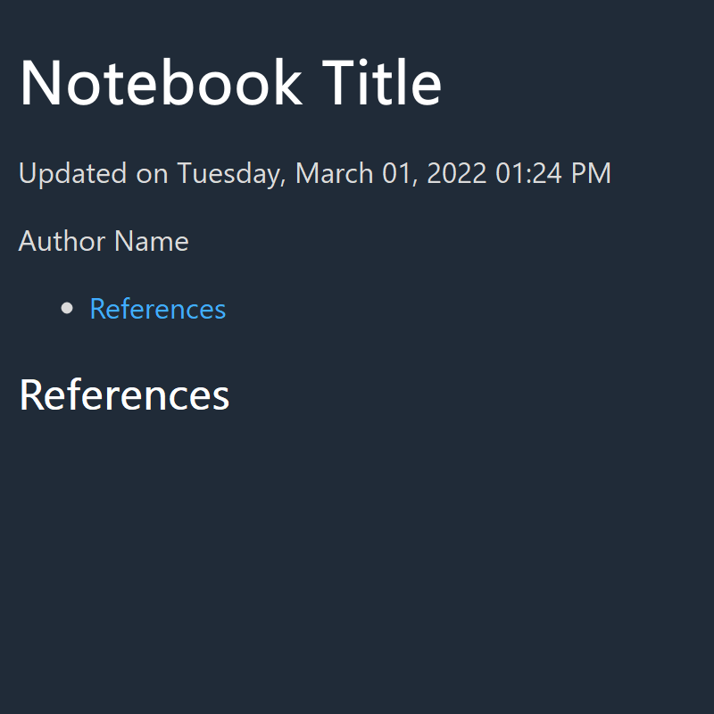

<!-- README.md is generated from README.Rmd. Please edit that file -->

# notestar 📓⭐

<!-- badges: start -->
<!-- badges: end -->

notestar is a notebook system built on the targets package: *notes* with
*tar*gets. I originally called this package tarnotes, but that sounded
gross.

**This README and the package are under development.**

## Installation

You can install notestar from [GitHub](https://github.com/) with:

``` r
# install.packages("devtools")
devtools::install_github("tjmahr/notestar")
```

## A small example

notestar works best inside of a data analysis project and specifically,
as a part of an RStudio project. That is, we have some folder for our
project, everything we do or create will live in the somewhere folder,
and that folder is the default working folder for all of our R code.

Let’s create a new folder inside of a temporary directory and make that
our project.

``` r
project_dir <- file.path(tempdir(), pattern = "my-project")
dir.create(project_dir)
setwd(project_dir)
```

`use_notestar()` will populate the project folder with some boilerplate
files.

``` r
library(notestar)
use_notestar()
#> v Creating 'R/'
#> v Writing 'R/functions.R'
#> v Creating 'notebook/'
#> v Creating 'notebook/book/'
#> v Creating 'notebook/book/assets/'
#> v Writing 'notebook/index.Rmd'
#> v Writing 'notebook/book/knitr-helpers.R'
#> v Writing 'notebook/0000-00-00-references.Rmd'
#> v Writing '_targets.R'
#> * Set Project Options > Build Tools to use a Makefile
#> v Setting active project to '<no active project>'
```

`targets::tar_make()` will then create the notebook.

``` r
targets::tar_make()
#> -- Attaching packages --------------------------------------- tidyverse 1.3.0 --
#> v ggplot2 3.3.3     v purrr   0.3.4
#> v tibble  3.1.0     v dplyr   1.0.5
#> v tidyr   1.1.3     v stringr 1.4.0
#> v readr   1.4.0     v forcats 0.5.1
#> -- Conflicts ------------------------------------------ tidyverse_conflicts() --
#> x dplyr::filter() masks stats::filter()
#> x dplyr::lag()    masks stats::lag()
#> * run target notebook_config
#> * run target 0000-00-00-references.Rmd
#> * run target index.Rmd
#> * run target spellcheck_exceptions
#> * run target notebook_output_yaml
#> * run target notebook_helper
#> * run target notebook_rmds
#> * run target 0000-00-00-references.md
#> * run target index.md
#> * run target spellcheck_notebook
#> * run target notebook_mds
#> * run target spellcheck_report_results_change
#> * run target notebook_bookdown_yaml
#> * run target spellcheck_report_results
#> No spelling errors found.
#> * run target notebook
#> 
#> 
#> processing file: index.Rmd
#>   |                                                                              |                                                                      |   0%  |                                                                              |......................................................................| 100%
#>    inline R code fragments
#> 
#> 
#> output file: index.knit.md
#> 
#> "C:/Program Files/RStudio/bin/pandoc/pandoc" +RTS -K512m -RTS notebook.utf8.md --to html5 --from markdown+autolink_bare_uris+tex_math_single_backslash --output notebook.html --lua-filter "C:\Users\Tristan\Documents\R\win-library\4.0\bookdown\rmarkdown\lua\custom-environment.lua" --lua-filter "C:\Users\Tristan\Documents\R\win-library\4.0\rmarkdown\rmarkdown\lua\pagebreak.lua" --lua-filter "C:\Users\Tristan\Documents\R\win-library\4.0\rmarkdown\rmarkdown\lua\latex-div.lua" --metadata-file "C:\Users\Tristan\AppData\Local\Temp\RtmpgP4SMg\file894299c28b3" --self-contained --variable disable-fontawesome --variable title-in-header --highlight-style pygments --table-of-contents --toc-depth 3 --mathjax --variable "mathjax-url:https://mathjax.rstudio.com/latest/MathJax.js?config=TeX-AMS-MML_HTMLorMML" --template "C:/Users/Tristan/Documents/R/win-library/4.0/cleanrmd/template/cleanrmd.html" --include-in-header "C:\Users\Tristan\AppData\Local\Temp\RtmpgP4SMg\rmarkdown-str894d8d6f60.html" 
#> 
#> Output created: docs/notebook.html
#> * end pipeline
```

Right now, it’s just the title page:



We can create a new entry from a template using `notebook_create_page()`
and regenerate the notebook. (A slug is some words we include in the
filename to help remember what the entry is about.)

``` r
notebook_create_page(slug = "hello-world")
#> v Setting active project to 'C:/Users/Tristan/AppData/Local/Temp/RtmpymnWCv/my-project'
#> v Writing 'notebook/2021-04-13-hello-world.Rmd'
#> * Edit 'notebook/2021-04-13-hello-world.Rmd'
#> v 'notebook/2021-04-13-hello-world.Rmd' created
targets::tar_make()
#> -- Attaching packages --------------------------------------- tidyverse 1.3.0 --
#> v ggplot2 3.3.3     v purrr   0.3.4
#> v tibble  3.1.0     v dplyr   1.0.5
#> v tidyr   1.1.3     v stringr 1.4.0
#> v readr   1.4.0     v forcats 0.5.1
#> -- Conflicts ------------------------------------------ tidyverse_conflicts() --
#> x dplyr::filter() masks stats::filter()
#> x dplyr::lag()    masks stats::lag()
#> v skip target notebook_config
#> * run target 2021-04-13-hello-world.Rmd
#> v skip target 0000-00-00-references.Rmd
#> v skip target index.Rmd
#> v skip target spellcheck_exceptions
#> v skip target notebook_output_yaml
#> v skip target notebook_helper
#> * run target notebook_rmds
#> * run target 2021-04-13-hello-world.md
#> v skip target 0000-00-00-references.md
#> v skip target index.md
#> * run target spellcheck_notebook
#> * run target notebook_mds
#> * run target spellcheck_report_results_change
#> * run target notebook_bookdown_yaml
#> v skip target spellcheck_report_results
#> * run target notebook
#> 
#> 
#> processing file: index.Rmd
#>   |                                                                              |                                                                      |   0%  |                                                                              |......................................................................| 100%
#>    inline R code fragments
#> 
#> 
#> output file: index.knit.md
#> 
#> "C:/Program Files/RStudio/bin/pandoc/pandoc" +RTS -K512m -RTS notebook.utf8.md --to html5 --from markdown+autolink_bare_uris+tex_math_single_backslash --output notebook.html --lua-filter "C:\Users\Tristan\Documents\R\win-library\4.0\bookdown\rmarkdown\lua\custom-environment.lua" --lua-filter "C:\Users\Tristan\Documents\R\win-library\4.0\rmarkdown\rmarkdown\lua\pagebreak.lua" --lua-filter "C:\Users\Tristan\Documents\R\win-library\4.0\rmarkdown\rmarkdown\lua\latex-div.lua" --metadata-file "C:\Users\Tristan\AppData\Local\Temp\RtmpmqMrEt\file333c7d703ca1" --self-contained --variable disable-fontawesome --variable title-in-header --highlight-style pygments --table-of-contents --toc-depth 3 --mathjax --variable "mathjax-url:https://mathjax.rstudio.com/latest/MathJax.js?config=TeX-AMS-MML_HTMLorMML" --template "C:/Users/Tristan/Documents/R/win-library/4.0/cleanrmd/template/cleanrmd.html" --include-in-header "C:\Users\Tristan\AppData\Local\Temp\RtmpmqMrEt\rmarkdown-str333c3a1b6c09.html" 
#> 
#> Output created: docs/notebook.html
#> * end pipeline
```

Now, that entry appears in the notebook.


## How it all works

targets + bookdown + some tricks

## scratch paper

``` r
fs::dir_tree(path = project_dir, all = TRUE)
```

-   `.here` is a sentinel file for the here package. It indicates where
    the project root is located.
-   `notebook/` houses the .Rmd files that become entries in the
    notebook. By default, it includes `index.Rmd` (a bookdown title
    page) and `0000-00-00-references.Rmd` (an entry for a pandoc
    bibliography provided at the end/bottom of the notebook).
-   `notebook/book/` houses the knitted versions of the `.Rmd` entries
    and a timestamped version of the `index.Rmd`. There is a special
    file here `knitr-helpers.R` which is run before the Rmd -&gt; md and
    before the md -&gt; notebook stage. `assets/` is where knitted
    images go and where other assets to include go.
-   `_targets.R` stores the workflow for building the notebook.
-   `R/functions.R` creates
